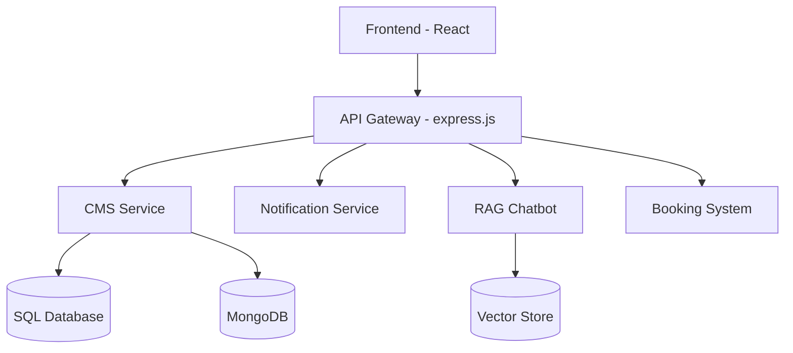

# Persönliches Portfolio

Eine moderne, interaktive Portfolio-Webseite mit flüssigen Animationen und responsivem Design.

## 🚀 Features

- **Vollständig responsives Design** - Optimiert für alle Bildschirmgrößen
- **Smooth Scroll Effekte** - Flüssige Seitenübergänge mit Snap-Scrolling
- **Mehrsprachig** - Unterstützung für Deutsch und Englisch
- **Moderne UI** - Clean Design mit Tailwind CSS
- **Touch-optimiert** - Touchscreen-freundliche Navigation
- **Docker Support** - Einfaches Deployment mit Docker

## 🛠 Tech Stack

- **Frontend Framework:** React mit TypeScript
- **Styling:** Tailwind CSS
- **Build Tool:** Vite
- **Containerization:** Docker
- **Internationalization:** i18next
- **CI/CD:** GitHub Actions

## 🐳 Docker Deployment

### Option 1: Docker Container

```bash
# Pull das Image
docker pull ghcr.io/linuspalma/portfolio:latest

# Starte den Container
docker run -d \
  --name portfolio \
  -p 3019:80 \
  ghcr.io/linuspalma/portfolio:latest
```

### Option 2: Docker Compose

Erstelle eine `docker-compose.yml`:

```yaml
services:
  portfolio:
    image: ghcr.io/linuspalma/portfolio:latest
    container_name: portfolio
    ports:
      - "3019:80"
    restart: unless-stopped
```

Dann ausführen mit:

```bash
docker compose up -d
```

Die Website ist dann unter `http://localhost:3019` erreichbar.

## 🚀 Geplante Erweiterungen

### Backend-Infrastruktur



#### Geplante Mikroservices:

1. **Content Management System**
   - SQL-Datenbank für strukturierte Inhalte
   - Admin-Dashboard für Content-Verwaltung
   - API für dynamische Inhalte

2. **Notification Server**
   - Echtzeit-Benachrichtigungen
   - Email-Integration
   - Push-Notifications

3. **RAG Chatbot**
   - KI-gestützte Benutzerinteraktion
   - Dokumenten-basierte Antworten
   - Kontext-bewusstes Chat-Interface

4. **Booking System**
   - Terminplanungssystem
   - Kalenderverwaltung
   - Automatische Bestätigungen

5. **Datenbank-Infrastruktur**
   - MongoDB für unstrukturierte Daten
   - SQL für relationale Daten
   - Vector Store für AI-Embeddings